# MagnumOpus Accessory Flow Map (Exact Recipe Trees)

This version is code-accurate and focused on actual recipe dependencies from AddRecipes().

## 0) Explicit Recipe Lookup (X = Y + Z)

Use this as direct crafting lookup.

### 0.1 Two-Theme

- NocturneOfAzureFlames = SonatasEmbrace + InfernalVirtuoso + HarmonicCoreOfMoonlightSonata (15) + HarmonicCoreOfLaCampanella (15)
- ValseMacabre = HerosSymphony + RiddleOfTheVoid + HarmonicCoreOfEroica (15) + HarmonicCoreOfEnigma (15)
- ReverieOfTheSilverSwan = SonatasEmbrace + SwansChromaticDiadem + HarmonicCoreOfMoonlightSonata (15) + HarmonicCoreOfSwanLake (15)
- FantasiaOfBurningGrace = InfernalVirtuoso + SwansChromaticDiadem + HarmonicCoreOfLaCampanella (15) + HarmonicCoreOfSwanLake (15)
- TriumphantArabesque = HerosSymphony + SwansChromaticDiadem + HarmonicCoreOfEroica (15) + HarmonicCoreOfSwanLake (15)
- InfernoOfLostShadows = InfernalVirtuoso + RiddleOfTheVoid + HarmonicCoreOfLaCampanella (15) + HarmonicCoreOfEnigma (15)

### 0.2 Three-Theme / Complete

- TrinityOfNight = NocturneOfAzureFlames + RiddleOfTheVoid + HarmonicCoreOfMoonlightSonata (20) + HarmonicCoreOfLaCampanella (20) + HarmonicCoreOfEnigma (20)
- AdagioOfRadiantValor = HerosSymphony + ReverieOfTheSilverSwan + HarmonicCoreOfEroica (20) + HarmonicCoreOfMoonlightSonata (20) + HarmonicCoreOfSwanLake (20)
- RequiemOfTheEnigmaticFlame = FantasiaOfBurningGrace + RiddleOfTheVoid + HarmonicCoreOfLaCampanella (20) + HarmonicCoreOfEnigma (20) + HarmonicCoreOfSwanLake (20)
- CompleteHarmony = SonatasEmbrace + HerosSymphony + InfernalVirtuoso + RiddleOfTheVoid + SwansChromaticDiadem + HarmonicCoreOfMoonlightSonata (50) + HarmonicCoreOfEroica (50) + HarmonicCoreOfLaCampanella (50) + HarmonicCoreOfEnigma (50) + HarmonicCoreOfSwanLake (50)

### 0.3 Seasonal Hybrids

- SpringsMoonlitGarden = BloomCrest + SonatasEmbrace + VernalBar (15) + ResonantCoreOfMoonlightSonata (15)
- SummersInfernalPeak = RadiantCrown + InfernalVirtuoso + SolsticeBar (15) + ResonantCoreOfLaCampanella (15)
- WintersEnigmaticSilence = GlacialHeart + RiddleOfTheVoid + PermafrostBar (15) + ResonantCoreOfEnigma (15)

### 0.4 Grand / Apex

- OpusOfFourMovements = CompleteHarmony + VivaldisMasterwork + MoonlightsResonantEnergy + EroicasResonantEnergy + LaCampanellaResonantEnergy + EnigmaResonantEnergy + SwansResonanceEnergy + DormantSpringCore + DormantSummerCore + DormantAutumnCore + DormantWinterCore
- CosmicWardensRegalia = ParadoxChronometer + ConstellationCompass + AstralConduit + MachinationoftheEventHorizon + OrreryofInfiniteOrbits + HarmonicCoreOfFate (50) + MoonlightsResonantEnergy + EroicasResonantEnergy + LaCampanellaResonantEnergy + EnigmaResonantEnergy + SwansResonanceEnergy
- SeasonalDestiny = VivaldisMasterwork + ParadoxChronometer + HarmonicCoreOfFate (30)
- ThemeWanderer = CompleteHarmony + MachinationoftheEventHorizon + HarmonicCoreOfFate (30)
- SummonersMagnumOpus = CompleteHarmony + OrreryofInfiniteOrbits + HarmonicCoreOfFate (30)
- CodaOfAbsoluteHarmony = OpusOfFourMovements + CosmicWardensRegalia + SpringsMoonlitGarden + SummersInfernalPeak + WintersEnigmaticSilence + CodaOfAnnihilationItem

### 0.5 Post-Fate Fusion Recipes (Class Chains)

- StarfallJudgmentGauntlet = NocturnalSymphonyBand + InfernalFortissimoBandT8 + NachtmusikResonantEnergy (10) + DiesIraeResonantEnergy (10)
- TriumphantCosmosGauntlet = StarfallJudgmentGauntlet + JubilantCrescendoBand + OdeToJoyResonantEnergy (15)
- GauntletOfTheEternalSymphony = TriumphantCosmosGauntlet + EternalResonanceBand + ClairDeLuneResonantEnergy (20)
- StarfallExecutionersScope = NocturnalPredatorsSight + InfernalExecutionersSight + NachtmusikResonantEnergy (10) + DiesIraeResonantEnergy (10)
- TriumphantVerdictScope = StarfallExecutionersScope + JubilantHuntersSight + OdeToJoyResonantEnergy (15)
- ScopeOfTheEternalVerdict = TriumphantVerdictScope + EternalVerdictSight + ClairDeLuneResonantEnergy (20)
- StarfallHarmonicPendant = NocturnalHarmonicOverflow + InfernalManaCataclysm + NachtmusikResonantEnergy (10) + DiesIraeResonantEnergy (10)
- TriumphantOverflowPendant = StarfallHarmonicPendant + JubilantArcaneCelebration + OdeToJoyResonantEnergy (15)
- PendantOfTheEternalOverflow = TriumphantOverflowPendant + EternalOverflowMastery + ClairDeLuneResonantEnergy (20)
- StarfallInfernalBaton = NocturnalMaestrosBaton + InfernalChoirmastersScepter + NachtmusikResonantEnergy (10) + DiesIraeResonantEnergy (10)
- TriumphantSymphonyBaton = StarfallInfernalBaton + JubilantOrchestrasStaff + OdeToJoyResonantEnergy (15)
- ScepterOfTheEternalConductor = TriumphantSymphonyBaton + EternalConductorsScepter + ClairDeLuneResonantEnergy (20)
- StarfallInfernalShield = NocturnalGuardiansWard + InfernalRampartOfDiesIrae + NachtmusikResonantEnergy (10) + DiesIraeResonantEnergy (10)
- TriumphantJubilantAegis = StarfallInfernalShield + JubilantBulwarkOfJoy + OdeToJoyResonantEnergy (15)
- AegisOfTheEternalBastion = TriumphantJubilantAegis + EternalBastionOfTheMoonlight + ClairDeLuneResonantEnergy (20)

## Legend

- Solid arrow: required ingredient item -> crafted result.
- Parenthetical values represent material counts when relevant.
- All nodes are class names from code.

## 1) Core Chain Crafting Trees

### 1.1 Melee

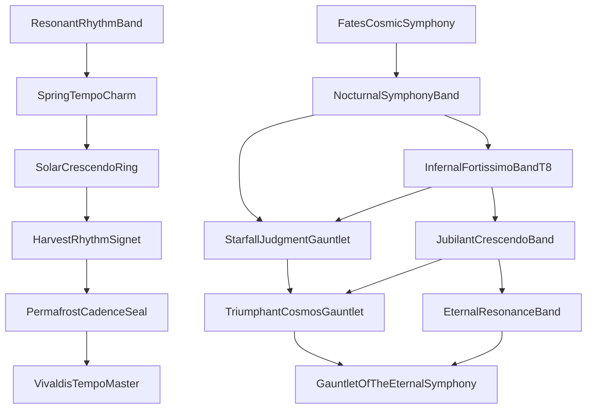

Notes:
- T7-T10 are theme-energy gated (Nachtmusik, Dies Irae, Ode to Joy, Clair de Lune).
- T7 does not require VivaldisTempoMaster in recipe; it keys off FatesCosmicSymphony progression stage.

### 1.2 Ranger

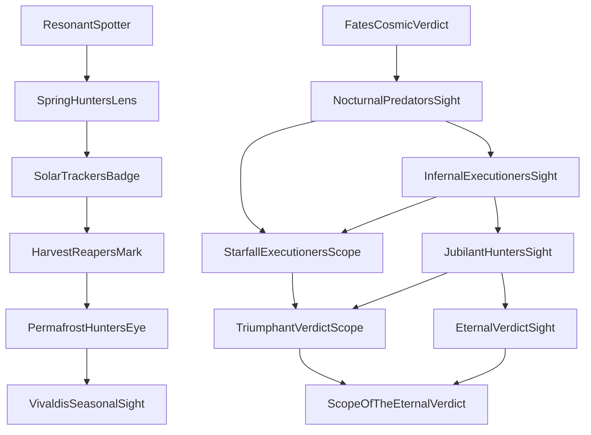

### 1.3 Mage

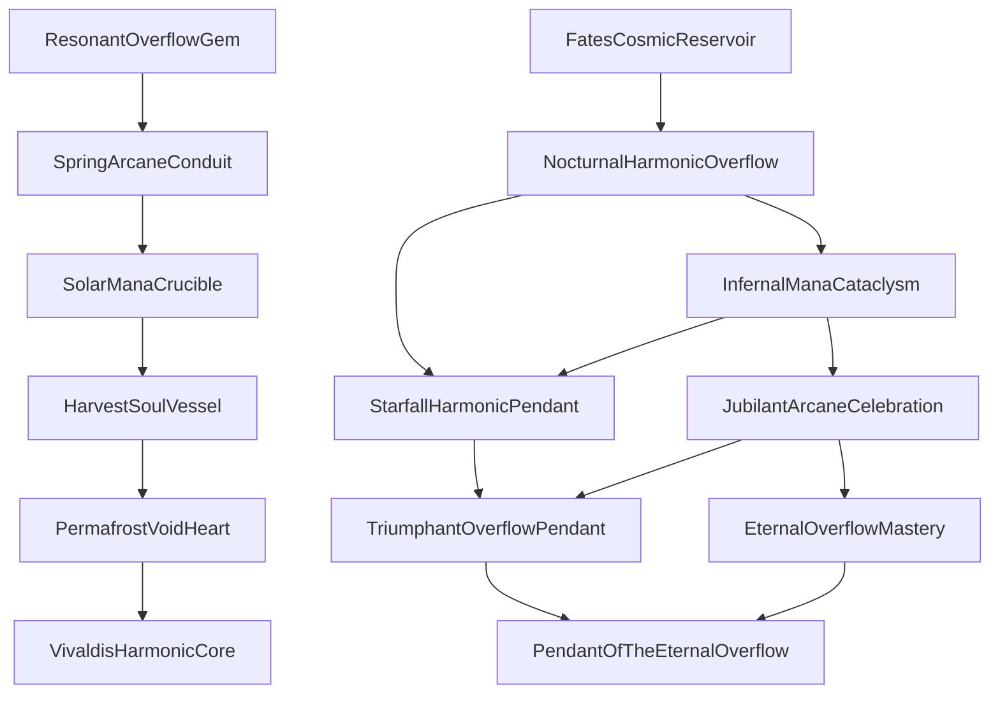

### 1.4 Summoner

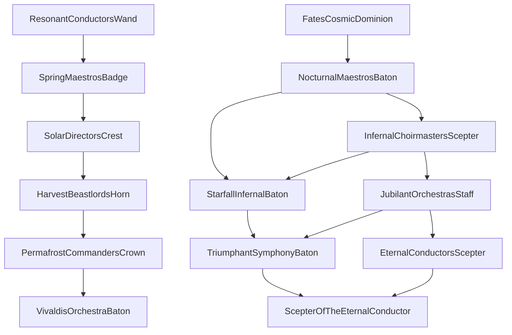

### 1.5 Defense

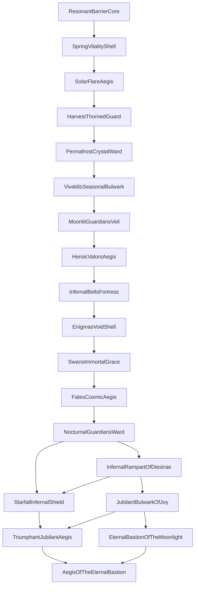

### 1.6 Mobility

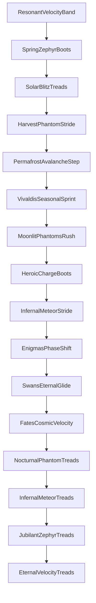

Note: Mobility has no T7+ fusion branch.

## 2) Theme Combination Trees

### 2.1 Two-Theme Layer

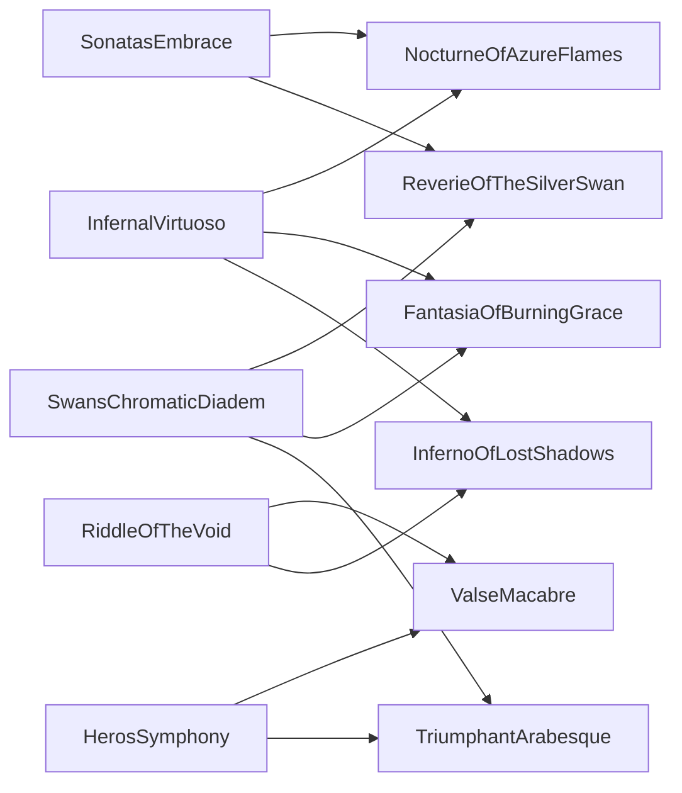

### 2.2 Three-Theme and Complete Layer

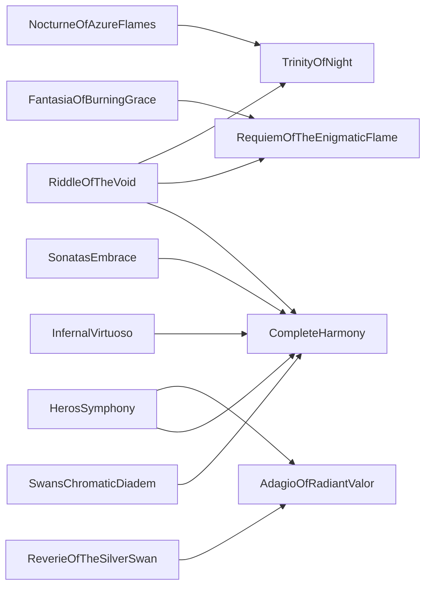

## 3) Seasonal Hybrid and Grand Trees

### 3.1 Seasonal Sources and Hybrids

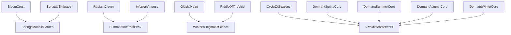

### 3.2 Grand Combinations

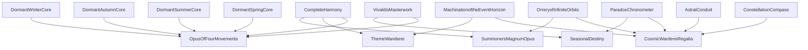

## 4) Final Apex Tree

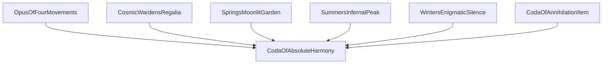

## 5) Key Material Counts Used in Combination Recipes

- NocturneOfAzureFlames: HarmonicCoreOfMoonlightSonata (15), HarmonicCoreOfLaCampanella (15).
- ValseMacabre: HarmonicCoreOfEroica (15), HarmonicCoreOfEnigma (15).
- ReverieOfTheSilverSwan: HarmonicCoreOfMoonlightSonata (15), HarmonicCoreOfSwanLake (15).
- FantasiaOfBurningGrace: HarmonicCoreOfLaCampanella (15), HarmonicCoreOfSwanLake (15).
- TriumphantArabesque: HarmonicCoreOfEroica (15), HarmonicCoreOfSwanLake (15).
- InfernoOfLostShadows: HarmonicCoreOfLaCampanella (15), HarmonicCoreOfEnigma (15).
- TrinityOfNight: HarmonicCoreOfMoonlightSonata/LaCampanella/Enigma (20 each).
- AdagioOfRadiantValor: HarmonicCoreOfEroica/MoonlightSonata/SwanLake (20 each).
- RequiemOfTheEnigmaticFlame: HarmonicCoreOfLaCampanella/Enigma/SwanLake (20 each).
- CompleteHarmony: HarmonicCoreOfMoonlightSonata/Eroica/LaCampanella/Enigma/SwanLake (50 each).
- CosmicWardensRegalia: HarmonicCoreOfFate (50).
- SeasonalDestiny, ThemeWanderer, SummonersMagnumOpus: HarmonicCoreOfFate (30 each).

## 6) Source Files for This Mapping

- Content/Common/Accessories/MeleeChain/MeleeChainAccessoriesTier1to4.cs
- Content/Common/Accessories/MeleeChain/MeleeChainAccessoriesTier5.cs
- Content/Common/Accessories/MeleeChain/MeleeChainAccessoriesTier6.cs
- Content/Common/Accessories/RangerChain/RangerChainAccessoriesTier1to4.cs
- Content/Common/Accessories/RangerChain/RangerChainAccessoriesTier5.cs
- Content/Common/Accessories/RangerChain/RangerChainAccessoriesTier6.cs
- Content/Common/Accessories/MageChain/MageChainAccessoriesTier1to4.cs
- Content/Common/Accessories/MageChain/MageChainAccessoriesTier5.cs
- Content/Common/Accessories/MageChain/MageChainAccessoriesTier6.cs
- Content/Common/Accessories/SummonerChain/SummonerChainAccessoriesTier1to4.cs
- Content/Common/Accessories/SummonerChain/SummonerChainAccessoriesTier5.cs
- Content/Common/Accessories/SummonerChain/SummonerChainAccessoriesTier6.cs
- Content/Common/Accessories/DefenseChain/DefenseChainAccessoriesTier1to4.cs
- Content/Common/Accessories/DefenseChain/DefenseChainAccessoriesTier5.cs
- Content/Common/Accessories/DefenseChain/DefenseChainAccessoriesTier6.cs
- Content/Common/Accessories/MobilityChain/MobilityChainAccessoriesTier1to4.cs
- Content/Common/Accessories/MobilityChain/MobilityChainAccessoriesTier5.cs
- Content/Common/Accessories/MobilityChain/MobilityChainAccessoriesTier6.cs
- Content/Common/Accessories/TwoThemeCombinationAccessories.cs
- Content/Common/Accessories/ThreeThemeCombinationAccessories.cs
- Content/Common/Accessories/SeasonThemeHybridAccessories.cs
- Content/Common/Accessories/GrandCombinationAccessories.cs
- Content/Common/Accessories/UltimateAccessory.cs
- Content/Seasons/Accessories/SeasonalCombinationAccessories.cs
